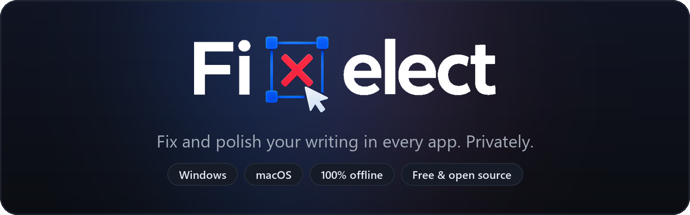
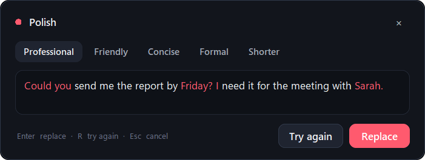
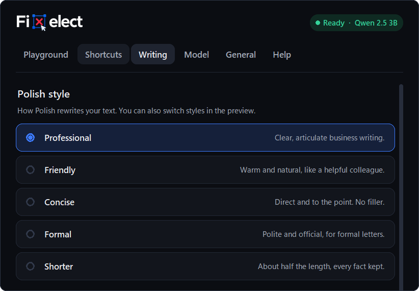

<p align="center">
  
</p>

<p align="center">
  <a href="https://github.com/Bosithonn/fixelect/releases/latest"></a>
  <a href="https://github.com/Bosithonn/fixelect/releases"></a>
  <a href="https://github.com/Bosithonn/fixelect/actions/workflows/release.yml"></a>
  <a href="LICENSE"></a>
</p>

<p align="center">
  <a href="https://github.com/Bosithonn/fixelect/releases/latest/download/FixelectSetup.exe"></a>
  &nbsp;
  <a href="https://github.com/Bosithonn/fixelect/releases/latest/download/Fixelect.dmg"></a>
  <br>
  <sub>Windows 10 / 11 (64-bit) · macOS 11+ on Apple Silicon · Free, no account</sub>
</p>

<br>

Select text in any app, press a shortcut, and Fixelect fixes it in place. The AI model runs on your computer, so your writing never leaves it.

```
Its been a long day, and i cant seem too focus on the the task.
                     ↓  double-tap Alt
It's been a long day, and I can't seem to focus on the task.
```

## Shortcuts

| | Windows | macOS | |
| :--- | :--- | :--- | :--- |
| **Fix** | Double-tap `Alt` | Double-tap `⌥ Option` | Typos, spelling and grammar. Your words and voice stay. |
| **Polish** | Double-tap `Ctrl` | Double-tap `⌃ Control` | A clearer rewrite, shown as a preview first. |

You can change both in Settings.

<p align="center">
  
</p>
<p align="center">
  
</p>

## Why Fixelect

- **Private.** Everything runs offline on your computer. No account, no cloud, no telemetry.
- **Works everywhere.** Browsers, email, Slack, Word, Google Docs, Notion. Bold, links and fonts are kept.
- **Your call.** Preview before replacing, and **Undo** in one click.
- **Five polish styles.** Professional, Friendly, Concise, Formal and Shorter, plus your own note like "Use British spelling".
- **Many languages.** English, Spanish, French, German, Portuguese, Italian, Russian and Ukrainian. Uzbek (beta) with the optional Gemma 4 model.
- **Free and open source** under the MIT License.

<p align="center">
  
</p>

## Install

**Windows.** Run `FixelectSetup.exe`. If Windows shows "Windows protected your PC", click **More info → Run anyway**. No administrator rights are needed.

**macOS.** Open `Fixelect.dmg` and drag Fixelect to Applications. If macOS says it can't be opened, go to **System Settings → Privacy & Security → Open Anyway**, then allow Accessibility when asked.

On first launch, Fixelect downloads the AI model you choose. The recommended one, Qwen 2.5 3B, is 2 GB. Each download is checked against its official SHA-256.

The installers aren't code-signed yet, which is why those warnings appear. Every release file has a `.sha256` checksum next to it.

<details>
<summary><b>Run from source</b></summary>

<br>

Python 3.11 or newer.

```bash
cd Windows          # or: cd MacOS
pip install -r requirements.txt
python fixelect.py  # or: python3 fixelect_mac.py
```

Tests that need no model:

```bash
python tests/test_guard.py
python tests/test_text.py
```

`Windows/` and `MacOS/` hold each app; `shared/` holds the code both use. Releases are built by [GitHub Actions](.github/workflows/release.yml).

</details>

## Privacy

Fixelect only goes online to download the model you pick and, unless you turn it off, to check GitHub once a day for updates. Your text is never sent anywhere. See the [privacy policy](PRIVACY_POLICY.md).

## License

[MIT](LICENSE) © 2026 Bositxon Erkinxonov. Third-party notices are in [LICENSE.txt](LICENSE.txt).

Issues and pull requests are welcome.
